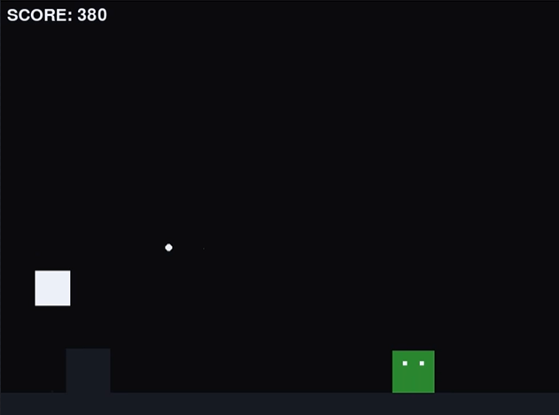

# Run

## ゲーム概要
* 無限に横スクロールするステージを、障害物をよけながらひたすら走り続けるゲーム

## 基本機能
### オブジェクト
* Player
* 障害物
* Enemy
### 操作
* w：ジャンプ（2段まで可能）
* space：弾発射
### システム
* 走っている間スコアが加点
* 1000スコアごとに加速
* Enemyに弾を当てるか、踏むと加点

## 追加機能
### アイテム
* 連射
* パルス
* 一回ガード
* ロケット（一定距離進む）
* 助っ人
### システム
* HP
* ボス
* enemyの種類
* 障害物の種類
* ステージの種類